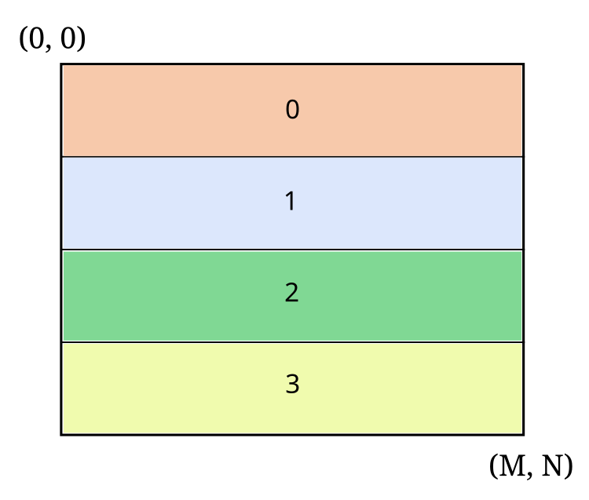
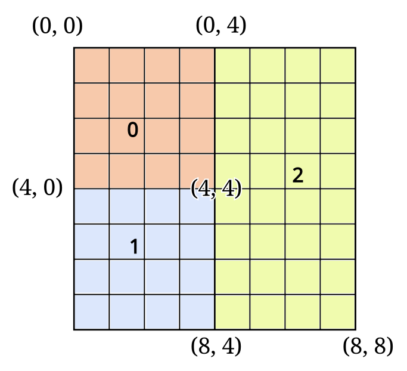
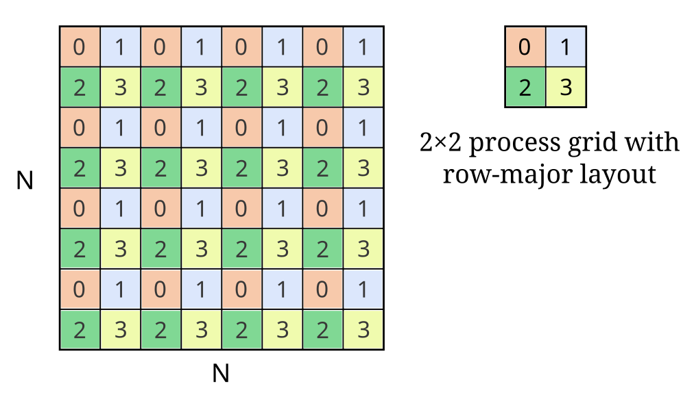
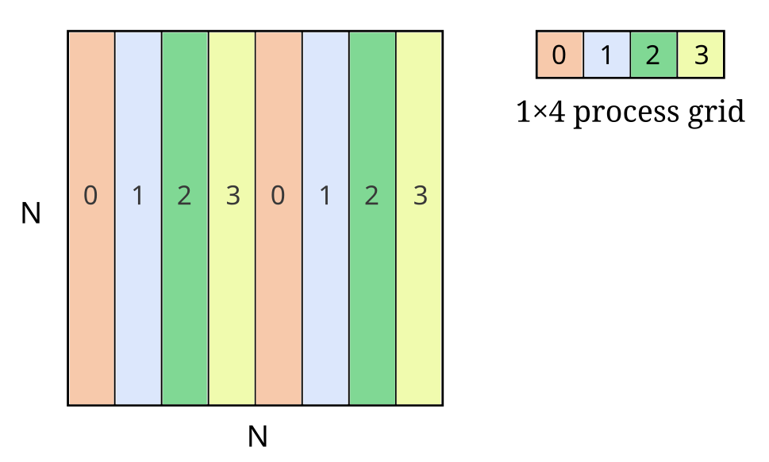
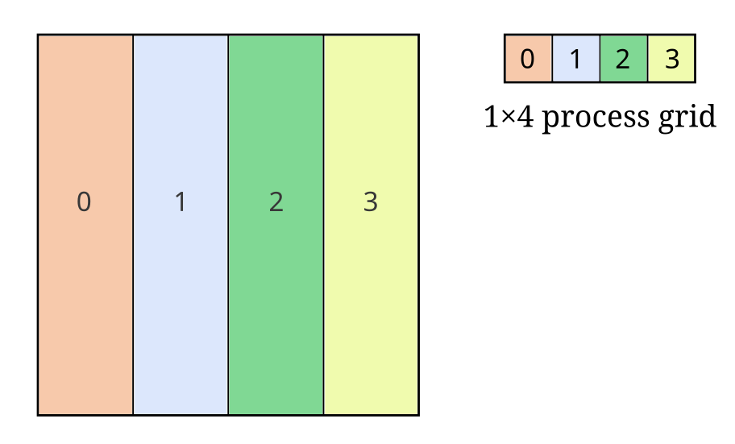

********************
Operand distribution
********************

To perform distributed math operations with ``nvmath.distributed`` you must first
specify how the operands are distributed across processes. nvmath-python supports
multiple distribution types (Slab, Box, BlockCyclic, etc.) which we'll explain in
this section.

You can use any distribution type for any distributed operation as long as nvmath-python
implements an implicit conversion to the native distribution type supported by the
operation. For example, the distributed dense linear algebra library (cuBLASMp)
supports the PBLAS 2D block-cyclic distribution and your input matrices must be
distributed in a way that conforms to this distribution type. Slab is compatible
with 2D block distribution for uniform partition sizes, so you can use Slab for
distributed matrix multiplication in such cases (see
`examples <https://github.com/NVIDIA/nvmath-python/tree/main/examples/distributed/
linalg/advanced/matmul>`_).

It's also important to consider the memory layout requirements of the distributed
operation that you're performing, and the potential implications on the distribution
of the global array. See
:ref:`Distribution, memory layout and transpose <distribution-mem-layout>` for more
information.

In the following we describe the available distribution types.

.. _distribution-slab:

Slab
====

Slab specifies the distribution of an N-D array that is partitioned across processes
along a single dimension. More formally:

- The shape of the slab on the first :math:`s_p \mathbin{\%} P` processes is
  :math:`(s_0, \ldots, \lfloor \frac{s_p}{P} \rfloor + 1, \ldots, s_{n-1})`
- The shape of the slab on the remaining processes is
  :math:`(s_0, \ldots, \lfloor \frac{s_p}{P} \rfloor, \ldots, s_{n-1})`
- Process 0 owns the first slab according to the global index order, process 1 owns
  the second slab and so on.

where:

- :math:`s_i` is the size of dimension :math:`i` of the global array
- :math:`p` is the partition dimension
- :math:`n` is the number of dimensions of the array
- :math:`P` is the number of processes

Let's look at an example with a 2D array and four processes:

Here we see a MxN 2D array partitioned on the X axis, where each number (and color) denotes
the slab of the global array owned by that process.

If :math:`(M, N) = (40, 64)`, the shape of the slab on every process will be
:math:`(10, 64)`.  For :math:`(M, N) = (39, 64)`, the shape of the slab on the first
three processes is :math:`(10, 64)` and the shape on the last process is :math:`(9, 64)`.

Using the ``nvmath.distributed`` APIs, you can specify the above distribution like this:

.. code-block:: python

    from nvmath.distributed.distribution import Slab

    distribution = Slab(partition_dim=0)
    # or
    distribution = Slab.X

.. tip::
    We offer convenience aliases to use with 1D/2D/3D arrays: ``Slab.X``,
    ``Slab.Y`` and ``Slab.Z`` (which partition on axis 0, 1 and 2, respectively).

.. note::
    Slab is natively supported by cuFFTMp (:doc:`distributed FFT API <fft/index>`).
    A Slab (or compatible) distribution is recommended for best performance in cuFFTMp.

.. _distributed-api-distributions-reference:

.. _distribution-box:

Box
===

Given a global N-D array, a N-D box can be used to describe a subsection of the global
array by indicating the lower and upper corner of the subsection. By associating boxes
to processes we can describe a data distribution where every process owns a contiguous
rectangular subsection of the global array.

For example, consider a 8x8 2D array distributed across 3 processes using the
following boxes:

where each number (and color) denotes the subsection of the global N-D array owned by
that process.

Using the ``nvmath.distributed`` APIs, you can specify the above distribution like this:

.. code-block:: python

    from nvmath.distributed.distribution import Box

    if process_id == 0:
        distribution = Box((0, 0), (4, 4))
    elif process_id == 1:
        distribution = Box((4, 0), (8, 4))
    elif process_id == 2:
        distribution = Box((0, 4), (8, 8))

.. note::

    Box is natively supported by cuFFTMp (:doc:`distributed FFT<fft/index>`
    and :ref:`Reshape <distributed-reshape-overview>` APIs).
    For further information, refer to the `cuFFTMp documentation
    <https://docs.nvidia.com/cuda/cufftmp/usage/api_usage.html
    #usage-with-custom-slabs-and-pencils-data-decompositions>`_.

.. _distribution-block:

Block distributions
===================

In the block-cyclic distribution, a global N-D array is split into blocks of a specified
shape and these blocks are distributed to a grid of processes in a cyclic pattern. As a
result, each process owns a set of typically non-contiguous blocks of the global N-D array.

PBLAS uses the block-cyclic distribution to distribute dense matrices in a way that evenly
balances the computational load across processes, while at the same time optimizing
performance by being able to exploit memory locality
(`reference <https://www.netlib.org/utk/papers/sc96-scalapack/NODE8.HTM>`_).

nvmath-python provides two distribution types based on block-cyclic, described below.

.. _distribution-block-cyclic:

BlockCyclic
-----------

BlockCyclic is specified with a process grid and a block size. The blocks assigned to
a process are typically non-contiguous owing to the cyclic distribution pattern.
Blocks can partition on any number of dimensions.

Consider the following example:

Here we see an NxN matrix distributed across 4 processes using a 2D block-cyclic scheme.
Each number (and color) denotes the blocks of the global matrix belonging to that
process. Each block has BxB elements and each process has 16 blocks.

Using the ``nvmath.distributed`` APIs, you can specify the above distribution like this:

.. code-block:: python

    from nvmath.distributed.distribution import ProcessGrid, BlockCyclic

    process_grid = ProcessGrid(
        shape=(2, 2), layout=ProcessGrid.Layout.ROW_MAJOR
    )
    distribution = BlockCyclic(process_grid, (B, B))

Note how the partition dimensions are determined by the process grid and block shape.
Here is an example of 1D block-cyclic distribution:

The above distribution can be specified like this:

.. code-block:: python

    from nvmath.distributed.distribution import ProcessGrid, BlockCyclic

    # layout is irrelevant in this case and can be omitted
    process_grid = ProcessGrid(shape=(1, 4))
    distribution = BlockCyclic(process_grid, (N, B))

.. note::
    Block distributions are natively supported by cuBLASMp
    (:doc:`distributed matrix multiplication APIs<linalg/index>`).

.. _distribution-block-non-cyclic:

BlockNonCyclic
--------------

BlockNonCyclic is a special case of BlockCyclic, where the block size and process grid are
such that it generates no cycles. For this distribution there is no need to specify block
sizes, as nvmath-python can infer them automatically.

.. tip::
    BlockNonCyclic is a convenience type and you can represent the same distribution with
    BlockCyclic and explicit block sizes.

Example 1D block non-cyclic:

The above distribution can be specified like this:

.. code-block:: python

    from nvmath.distributed.distribution import ProcessGrid, BlockNonCyclic

    # layout is irrelevant in this case and can be omitted
    process_grid = ProcessGrid(shape=(1, 4))
    distribution = BlockNonCyclic(process_grid)

.. note::
    Block distributions are natively supported by cuBLASMp
    (:doc:`distributed matrix multiplication APIs<linalg/index>`).

.. tip::
    Slab and BlockNonCyclic are equivalent for uniform partition sizes.

Utilities
=========

You can get the local shape of an operand according to a distribution by querying the
distribution:

.. code-block:: python

    from nvmath.distributed.distribution import Slab

    global_shape = (64, 48, 32)
    # Get the local shape on this process according to Slab.Y
    shape = Slab.Y.shape(process_id, global_shape)

If desired, you may do explicit conversion between distribution types. For example:

.. code-block:: python

    from nvmath.distributed.distribution import ProcessGrid, BlockNonCyclic, Slab

    # layout is irrelevant in this case and can be omitted
    process_grid = ProcessGrid(shape=(1, 4))
    distribution = BlockNonCyclic(process_grid)
    slab_distribution = distribution.to(Slab)
    print(slab_distribution)  # prints "Slab(partition_dim=1, ndim=2)"

.. _distribution-mem-layout:

Distribution, memory layout and transpose
=========================================

Memory layout refers to the way that N-D arrays are stored in memory on each process.
The two primary layouts are C-order (row-major) and Fortran-order (column-major).
Memory layout is independent of the distribution of the global array, i.e. you can have
any combination of distribution and local memory layout. In practice, however, math
libraries have specific requirements on memory layout. For example, cuFFTMp requires
C-order while cuBLASMp requires Fortran-order. As such, you may find that you have
to convert the layout of your inputs. Two common ways to convert the layout are:

1. **Copy** the array to a buffer with the new layout (*expensive, preserves the
   distribution*).

   For example:

   .. code-block:: python

       # Get the local shape according to Slab.X
       a_shape = Slab.X.shape(process_id, (m, n))
       # Allocate operand on this process (NumPy uses C-order by default).
       a = np.random.rand(*a_shape)
       # Convert layout to F-order by copying to a new array (distribution is preserved)
       a = np.asfortranarray(a)

2. Get a **transposed view** (*efficient, modifies the distribution*).

   Transposing a global array *transposes the distribution*, and so always results
   in a different distribution. For example:

   .. code-block:: python

       # Get the local shape according to Slab.X
       a_shape = Slab.X.shape(process_id, (m, n))
       # Allocate operand on this process (NumPy uses C-order by default).
       a = np.random.rand(*a_shape)
       # Transpose the global array (transposing on each process)
       a = a.T  # the distribution of a is now Slab.Y

.. note::
    Transposing changes the global shape of the operand and will accordingly impact the
    distributed operation. For example, if the global shape of the input matrix A of
    distributed matrix multiplication is :math:`(k, m)`, you have to set the
    ``is_transpose`` qualifier to ``True`` for A. Similarly if B is transposed. See
    :doc:`Distributed Linear Algebra <linalg/index>` for more information.

.. hint::
    For matrices, ``transpose(Slab.X) == Slab.Y`` and ``transpose(Slab.Y) == Slab.X``.

.. seealso::
    See
    `distributed matmul examples
    <https://github.com/NVIDIA/nvmath-python/tree/main/examples/ distributed/linalg/
    advanced/matmul>`_ for more examples showing the interaction between memory layout,
    transpose and distribution.

API Reference
=============

.. module:: nvmath.distributed.distribution

.. autosummary::
   :toctree: generated/

   Slab
   Box
   ProcessGrid
   BlockCyclic
   BlockNonCyclic
