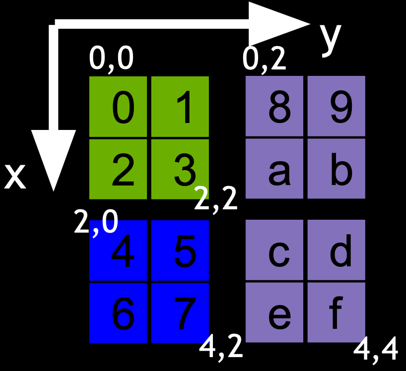

*******************
Distributed Reshape
*******************

.. _distributed-reshape-overview:

Overview
========

The distributed reshape module :mod:`nvmath.distributed.reshape` in
nvmath-python leverages the NVIDIA cuFFTMp library and provides APIs that can
be directly called from the host to efficiently redistribute local operands
on multiple processes on multi-node multi-GPU systems at scale. Both stateless
function-form APIs and stateful class-form APIs are provided:

- function-form reshape using :func:`nvmath.distributed.reshape.reshape`.
- stateful reshape using :class:`nvmath.distributed.reshape.Reshape`.

Reshape is a general-purpose API to change how data is distributed or
partitioned across processes, by shuffling data among the processes.
Distributed reshape supports arbitrary data distributions in the form of
1D/2D/3D boxes.

.. _distributed-reshape-box:

Box distribution
----------------

Consider a ``X*Y*Z`` global array. 3D boxes can be used to describe a subsection
of this global array by indicating the lower and upper corner of the subsection.
By associating boxes to processes one can then describe a data distribution where
every process owns a contiguous rectangular subsection of the global array.

For instance, consider a 2D case with a global array of size ``X*Y = 4*4`` and
three boxes, described as ``box = [lower, upper]``:

.. code-block:: python

    box_0 = [(0,0), (2,2)]  # green
    box_1 = [(2,0), (4,2)]  # blue
    box_2 = [(0,2), (4,4)]  # purple

By associating box 0 to process 0, box 1 to process 1 and box 2 to process 2, this creates a
data distribution of the global ``4*4`` array across three processes. The same can be
generalized to N-D arrays and any number of processes.

For more information, refer to the `cuFFTMp documentation
<https://docs.nvidia.com/cuda/cufftmp/usage/api_usage.html
#usage-with-custom-slabs-and-pencils-data-decompositions>`_.

Example
-------

To perform a distributed reshape, each process specifies its own input and output box, which
determines the distribution of the input and output, respectively.

As an example, consider a matrix that is distributed column-wise on two processes (each
process owns a contiguous chunk of columns). To redistribute the matrix row-wise, we can use
distributed reshape:

.. tip::
    Reminder to initialize the distributed context first as per
    :ref:`distributed-api-initialize`.

.. code-block:: python

    # The global dimensions of the matrix are 4x4. The matrix is distributed
    # column-wise, so each process has 4 rows and 2 columns.

    # Get process rank from mpi4py communicator.
    rank = communicator.Get_rank()

    # Initialize the matrix on each process, as a NumPy ndarray (on the CPU).
    A = np.zeros((4, 2)) if rank == 0 else np.ones((4, 2))

    # Reshape from column-wise to row-wise.
    if rank == 0:
        input_box = [(0, 0), (4, 2)]
        output_box = [(0, 0), (2, 4)]
    else:
        input_box = [(0, 2), (4, 4)]
        output_box = [(2, 0), (4, 4)]

    # Distributed reshape returns a new operand with its own buffer.
    B = nvmath.distributed.reshape.reshape(A, input_box, output_box)

    # The result is a NumPy ndarray, distributed row-wise:
    # [0] B:
    # [[0. 0. 1. 1.]
    #  [0. 0. 1. 1.]]
    #
    # [1] B:
    # [[0. 0. 1. 1.]
    #  [0. 0. 1. 1.]]
    print(f"[{rank}] B:\n{B}")

.. _distributed-reshape-api-reference:

API Reference
=============

.. module:: nvmath.distributed.reshape

Reshape support (:mod:`nvmath.distributed.reshape`)
---------------------------------------------------

.. autosummary::
   :toctree: generated/

   reshape
   Reshape

   :template: dataclass.rst

   ReshapeOptions
