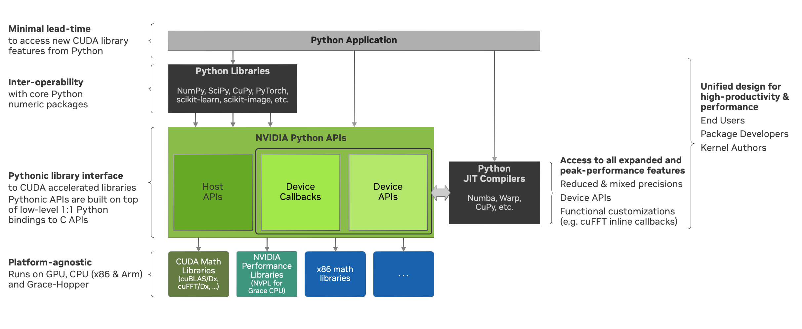

.. _nvmath overview:

Overview
********

The primary goal of nvmath-python is to bring the power of the NVIDIA math libraries to the
Python ecosystem. The package aims to provide intuitive pythonic APIs that provide users
full access to all the features offered by our libraries in a variety of execution spaces.

We hope to empower a wide range of Python users by providing easy access to high-performance
core math operations such as FFT, dense and sparse linear algebra, and more. This includes
the following groups of users:

1. **Practitioners**: Researchers and application programmers who require robust,
   high-performance mathematical tools.
2. **Library Package Developers**: Developers crafting libraries that rely on advanced
   mathematical operations.
3. **CUDA Kernel Authors**: Programmers who write CUDA kernels and need customized
   mathematical functionality.

The APIs provided by nvmath-python can be categorized into:

- **Host APIs**: Invoked from the host and executed in the chosen space (currently limited
  to single GPUs).
- **Device APIs**: Called directly from within CUDA kernels.

nvmath-python is dedicated to delivering the following key features and commitments:

1. **Logical Feature Parity**: While the pythonic API surface (the number of APIs and the
   complexity of each) is more concise compared to that of the C libraries, it provides
   access to their complete functionality.
2. **Consistent Design Patterns**: Uniform design across all modules to simplify user
   experience.
3. **Transparency and Explicitness**: Avoiding implicit, costly operations such as copying
   data across the same memory space, automatic type promotion, and alterations to the user
   environment or state (current device, current stream, etc.). This allows users to perform
   the required conversion once for use in all subsequent operations instead of incurring
   hidden costs on each call.
4. **Clear, Actionable Error Messages**: Ensuring that errors are informative and helpful in
   resolving the problem.
5. **DRY Principle Compliance**: Automatically utilizing available information such as the
   current stream and memory pool to avoid redundant specification ("don't repeat
   yourself").

With nvmath-python, a few lines of code are sufficient to unlock the extensive performance
capabilities of the NVIDIA math libraries. Explore our sample Python codes and more detailed
examples in the `examples directory on GitHub
<https://github.com/NVIDIA/nvmath-python/tree/main/examples>`_.

Architecture
============

nvmath-python is designed to support integration at any level desired by the user. This
flexibility allows:

- Alice, a **Python package developer**, to utilize core math operations to compose into
  higher-level algorithms or adapt these operations into her preferred interfaces.
- Bob, an **application developer**, to use core operations directly from nvmath-python or
  indirectly through other libraries that leverage math-python.
- Carol, a **researcher**, to write kernels entirely in Python that call core math
  operations such as FFT.

Additionally, we offer :doc:`Python bindings <bindings/index>` that provide a 1:1 mapping
with the C APIs. These bindings, which serve as wrappers with API signatures similar to
their C counterparts, are ideal for library developers looking to integrate the capabilities
of the NVIDIA Math Libraries in a customized manner, in the event that the pythonic APIs
don't meet their specific requirements. Conversely, our high-level pythonic APIs deliver a
fully integrated solution suitable for native Python users as well as library developers,
encompassing both host and device APIs. In the future, select host APIs will accept
**callback functions written in Python** and compiled into supported formats such as LTO-IR,
using compilers like `Numba`_.

.. _host api section:

Host APIs
=========

.. _host apis:

nvmath-python provides a collection of APIs that can be directly invoked from the CPU
(host). At present, these APIs encompass a selection of functionalities within the following
categories:

- Fast Fourier Transform in :mod:`nvmath.fft`. Refer to :doc:`Fast Fourier Transform
  <fft/index>` for details.
- Linear Algebra in :mod:`nvmath.linalg`. Refer to :doc:`Linear Algebra
  <linalg/index>` for details.

.. _host api interop:

Effortless Interoperability
---------------------------

All host APIs support input arrays/tensors from NumPy, CuPy, and PyTorch while returning
output operands using the same package, thus offering effortless interoperability with these
frameworks. One example for the interoperability is shown below:

.. code-block:: python

    import numpy as np
    import nvmath

    # Create a numpy.ndarray as input
    a = np.random.random(128) + 1.j * np.random.random(128)

    # Call nvmath-python pythonic APIs
    b = nvmath.fft.fft(a)

    # Verify that output is also a numpy.ndarray
    assert isinstance(b, np.ndarray)

.. _host api types:

Stateless and Stateful APIs
---------------------------

The host APIs within nvmath-python can be generally categorized into two types: stateless
function-form APIs and stateful class-form APIs.

The function-form APIs, such as :func:`nvmath.fft.fft` and
:func:`nvmath.linalg.advanced.matmul`, are designed to deliver quick, end-to-end results
with a single function call. These APIs are ideal for instances where a user needs to
perform a single computation without the need for intermediate steps, customization of
algorithm selection, or cost amortization of preparatory steps. Conversely, the stateful
class-form APIs, like :class:`nvmath.fft.FFT` and :class:`nvmath.linalg.advanced.Matmul`,
offer a more comprehensive and flexible approach. They not only encompass the functionality
found in their function-form counterparts but also allow for amortization of one-time costs,
potentially enhancing performance significantly.

The design pattern for all stateful APIs in nvmath-python consists of several key phases:

    - Problem Specification: This initial phase involves defining the operation and setting
      options that affect its execution. It's designed to be as lightweight as possible,
      ensuring the problem is well-defined and supported by the current implementation.
    - Preparation: Using FFT as an example, this phase includes a planning step to select
      the optimal algorithm for the defined FFT operation. An optional autotuning operation,
      when available, also falls within the preparation phase. The preparation phase is
      generally the most resource-intensive and may incorporate user-specified planning and
      autotuning options.
    - Execution: This phase allows for repeated execution, where the operand can be either
      modified in-place or explicitly reset using the ``reset_operand``/``reset_operands``
      method. The costs associated with the first two phases are therefore amortized over
      these multiple executions.
    - Resource Release: Users are advised to use stateful objects from within a context
      using the `with statement
      <https://docs.python.org/3/reference/compound_stmts.html#the-with-statement>`_, which
      automatically handles the release of internal resources upon exit. If the object is
      not used as a context manager using ``with``, it is necessary to explicitly call the
      ``free`` method to ensure all resources are properly released.

.. note::

    By design, nvmath-python does NOT cache plans with stateless function-form APIs. This is
    to enable library developers and others to use their own caching mechanisms with
    nvmath-python. Therefore users should use the stateful object APIs for repeated use as
    well as benchmarking to avoid incurring repeated preparatory costs, or use a cached API
    (see `caching.py
    <https://github.com/NVIDIA/nvmath-python/tree/main/examples/fft/caching.py>`_ for an
    example implementation).

.. note::

    The decision to require explicit ``free`` calls for resource release is driven by the
    fact that Python's garbage collector can delay freeing object resources when the object
    goes out of scope or its reference count drops to zero. For details, refer to the
    `__del__ method Python documentation
    <https://docs.python.org/3/reference/datamodel.html#object.__del__>`_.

.. _generic specialized:

Generic and Specialized APIs
----------------------------

Another way of categorizing the host APIs within nvmath-python is by splitting them into
*generic* and *specialized* APIs, based on their flexibility and the scope of their
functionality:

- **Generic APIs** are designed to accommodate a broad range of operands and customization
  with these APIs is confined to options that are universally applicable across all
  supported operand types. For instance, the generic matrix multiplication API can handle
  structured matrices (such as triangular and banded, in full or packed form) in addition to
  dense full matrices, but the available options are limited to those applicable to all
  these matrix types.

- **Specialized APIs**, on the other hand, are tailored for specific types of operands,
  allowing for full customization that is available to this kind. A prime example is the
  specialized matrix multiplication API for dense matrices, which provides numerous options
  specifically suited to dense matrices.

It should be noted that the notion of generic and specialized APIs is orthogonal to the
notion of stateful versus stateless APIs. Currently, nvmath-python offers the specialized
interface for dense matrix multiplication, in :class:`stateful
<nvmath.linalg.advanced.Matmul>` and :func:`stateless <nvmath.linalg.advanced.matmul>`
forms.

.. _high-level api logging:

Full Logging Support
--------------------

nvmath-python provides integration with the Python standard library logger from the `logging
module <https://docs.python.org/3/library/logging.html>`_ to offer full logging of the
computational details at various levels, for example debug, information, warning and error. An
example illustrating the use of the global Python logger is shown below:

.. code-block:: python

    import logging

    # Turn on logging with level set to "debug" and use a custom format for the log
    logging.basicConfig(
      level=logging.DEBUG,
      format='%(asctime)s %(levelname)-8s %(message)s',
      datefmt='%m-%d %H:%M:%S'
   )

    # Call nvmath-python pythonic APIs
    out = nvmath.linalg.advanced.matmul(...)

Alternatively, for APIs that contain the ``options`` argument, users can set a custom logger
by directly passing it inside a dictionary or as part of the corresponding ``Options``
object, for example :attr:`nvmath.fft.FFTOptions.logger` for :func:`nvmath.fft.fft` and
:class:`nvmath.fft.FFT`. An example based on FFT is shown below:

.. code-block:: python

    import logging

    # Create a custom logger
    logger = logging.getLogger('userlogger')
    ...

    # Call nvmath-python pythonic APIs
    out = nvmath.fft.fft(..., options={'logger': logger})

For the complete examples, refer to `global logging example
<https://github.com/NVIDIA/nvmath-python/tree/main/examples/fft/
example04_logging_global.py>`_
and `custom user logging example
<https://github.com/NVIDIA/nvmath-python/tree/main/examples/fft/
example04_logging_user.py>`_.

.. note::

  The Python logging is orthogonal to the logging provided by certain NVIDIA math libraries,
  which encapsulates low level implementation details and can be activated via either
  specific environment variables (for example ``CUBLASLT_LOG_LEVEL`` for ``cuBLASLt``) or
  programmatically through the Python bindings (for example
  :func:`nvmath.bindings.cusolverDn.logger_set_level` for ``cuSOLVER``).

.. _high-level call blocking:

Call Blocking Behavior
----------------------

By default, calls to all pythonic host APIs that require GPU execution are *not* blocking if
the input operands reside on the device. This means that functions like
:func:`nvmath.linalg.advanced.matmul`, :meth:`nvmath.fft.FFT.execute`, and
:meth:`nvmath.linalg.advanced.Matmul.execute` will return immediately after the operation is
launched on the GPU without waiting for it to complete. Users are therefore responsible for
properly synchronizing the stream when needed. The default behavior can be modified by
setting the ``blocking`` attribute (default ``'auto'``) of the relevant ``Options`` object
to ``True``. For example, users may set :attr:`nvmath.fft.FFTOptions.blocking` to ``True``
and pass this options object to the corresponding FFT API calls. If the input operands are
on the host, the pythonic API calls will always block since the computation yields an output
operand that will also reside on the host. Meanwhile, APIs that execute on the host (such as
:meth:`nvmath.fft.FFT.create_key`) always block.

.. _high-level stream semantics:

Stream Semantics
----------------

The stream semantics depend on whether the behavior of the execution APIs is chosen to be
blocking or non-blocking (see :ref:`high-level call blocking`).

For blocking behavior, stream ordering is automatically handled by the nvmath-python
high-level APIs for *operations that are performed within the package*. A stream can be
provided for two reasons:

1. When the computation that prepares the input operands is not already complete by the time
   the execution APIs are called. This is a correctness requirement for user-provided data.
2. To enable parallel computations across multiple streams if the device has sufficient
   resources and the current stream (which is the default) has concomitant operations. This
   can be done for performance reasons.

For non-blocking behavior, it is the user's responsibility to ensure correct stream ordering
between the execution API calls.

In any case, the execution APIs are launched on the provided stream.

For examples on stream ordering, refer to `FFT with multiple streams
<https://github.com/NVIDIA/nvmath-python/tree/main/examples/fft/example09_streams.py>`_.

.. _high-level memory management:

Memory Management
-----------------

By default, the host APIs use the memory pool from the package that their operands belong
to. This ensures that there is no contention for memory or spurious out-of-memory errors.
However the user also has the ability to provide their own memory allocator if they choose
to do so. In our pythonic APIs, we support an `EMM`_-like interface as proposed and
supported by Numba for users to set their Python mempool. Taking FFT as an example, users
can set the option :attr:`nvmath.fft.FFTOptions.allocator` to a Python object complying with
the :class:`nvmath.BaseCUDAMemoryManager` protocol, and pass the options to the high-level
APIs like :func:`nvmath.fft.fft` or :class:`nvmath.fft.FFT`. Temporary memory allocations
will then be done through this interface. Internally, we use the same interface to use CuPy
or PyTorch's mempool depending on the operands.

.. note::

    nvmath's :class:`~nvmath.BaseCUDAMemoryManager` protocol is slightly different from
    Numba's EMM interface (:class:`numba.cuda.BaseCUDAMemoryManager`), but duck typing with
    an existing EMM instance (not type!) at runtime should be possible.

.. _EMM: https://numba.readthedocs.io/en/stable/cuda/external-memory.html

.. _host api callback section:

Host APIs with Callbacks
========================

.. _host apis callback:

Certain host APIs (such as :func:`nvmath.fft.fft` and :meth:`nvmath.fft.FFT.plan`) allow the
user to provide prolog or epilog functions *written in Python*, resulting in a *fused
kernel*. This improves performance by avoiding extra roundtrips to global memory and
effectively increases the arithmetic intensity of the operation.

.. code-block:: python

   import cupy as cp
   import nvmath

   # Create the data for the batched 1-D FFT.
   B, N = 256, 1024
   a = cp.random.rand(B, N, dtype=cp.float64) + 1j * cp.random.rand(B, N, dtype=cp.float64)

   # Compute the normalization factor.
   scale = 1.0 / N

   # Define the epilog function for the FFT.
   def rescale(data_out, offset, data, user_info, unused):
      data_out[offset] = data * scale

   # Compile the epilog to LTO-IR (in the context of the execution space).
   with a.device:
      epilog = nvmath.fft.compile_epilog(rescale, "complex128", "complex128")

   # Perform the forward FFT, applying the filter as an epilog...
   r = nvmath.fft.fft(a, axes=[-1], epilog={"ltoir": epilog})

.. _device api section:

Device APIs
===========

.. _device apis:

The :doc:`device APIs <device-apis/index>` enable the user to call core mathematical
operations in their Python CUDA kernels, resulting in a *fully fused kernel*. Fusion is
essential for performance in latency-dominated cases to reduce the number of kernel
launches, and in memory-bound operations to avoid the extra roundtrip to global memory.

We currently offer support for calling FFT, matrix multiplication, and random number
generation APIs in kernels written using `Numba`_, with plans to offer more core operations
and support other compilers in the future. The design of the device APIs closely mimics that
of the C++ APIs from the corresponding NVIDIA Math Libraries (MathDx libraries `cuFFTDx
<https://docs.nvidia.com/cuda/cufftdx/1.2.0>`_ and `cuBLASDx
<https://docs.nvidia.com/cuda/cublasdx/0.1.1>`_ for FFT and matrix multiplication, and
`cuRAND device APIs <https://docs.nvidia.com/cuda/curand/group__DEVICE.html#group__DEVICE>`_
for random number generation).

.. _commitment:

Compatibility Policy
====================

nvmath-python is no different from any Python package, in that we would not succeed without
depending on, collaborating with, and evolving alongside the Python community. Given these
considerations, we strive to meet the following commitments:

1. For the :doc:`low-level Python bindings <bindings/index>`,

   * if the library to be bound is part of CUDA Toolkit, we support the library from the
     most recent two CUDA major versions (currently CUDA 11/12)
   * otherwise, we support the library within its major version

   Note that all bindings are currently *experimental*.

2. For the high-level pythonic APIs, we maintain backward compatibility to the greatest
   extent feasible. When a breaking change is necessary, we issue a runtime warning to alert
   users of the upcoming changes in the next major release. This practice ensures that
   breaking changes are clearly communicated and reserved for major version updates,
   allowing users to prepare and adapt without surprises.
3. We comply with `NEP-29`_ and support a community-defined set of core dependencies
   (CPython, NumPy, etc).

.. note::
    The policy on backwards compatibility will apply starting with release ``1.0.0``.

.. _NEP-29: https://numpy.org/neps/nep-0029-deprecation_policy.html

.. _Numba: https://numba.readthedocs.io/en/stable/cuda/index.html
